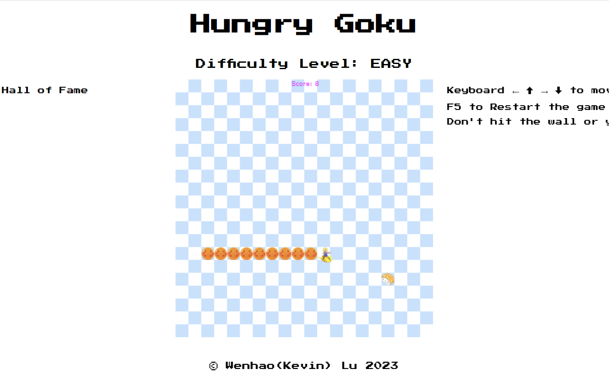

# Snake Game v1.2

This is a simple Snake game core integrated with intuitive Anime-UI using JavaScript and HTML5 Canvas. It allows players to control an anime character - Goku and dragon ball- and eat food to grow longer. The objective is to avoid colliding with walls or the character's own body. The game provides different difficulty levels and keeps track of the player's score.

## Demo

You can play the game online [here](http://game.wlkevin.com/).

## Screenshots

## Features

- Simple keyboard controls
- Adjustable difficulty levels (easy, medium, hard)
- Score tracking (function in progress)
- Randomly generated food items

## Technologies Used

- Pure JavaScript
- HTML5 Canvas

## How to Play

1. Use the arrow keys on your keyboard to control the character's movement.
2. Different difficulty levels given to different movement speeds.
3. The goal is to eat the food items and avoid colliding with walls or the character's own body.
4. Each time the character eats a food item, it will grow longer, and your score will increase.
5. The game ends when the character collides with a wall or its own body.
6. More features in progress.
